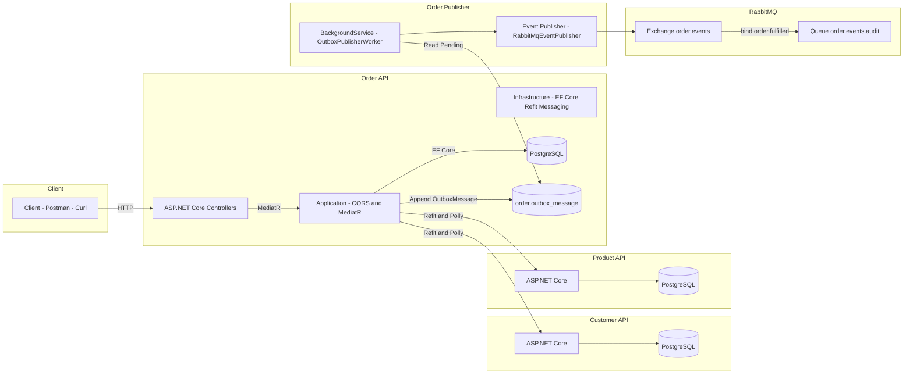
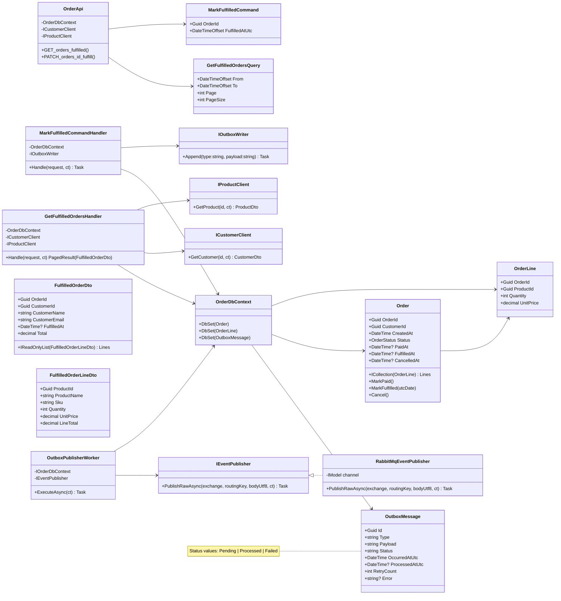
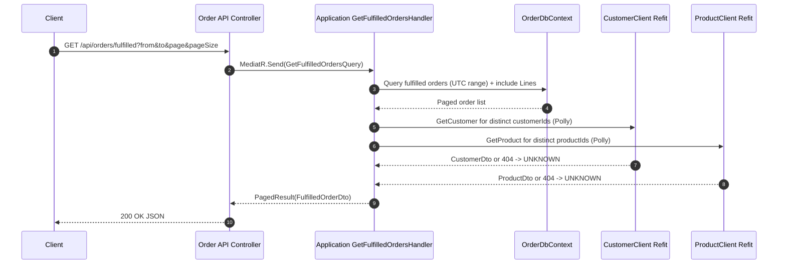
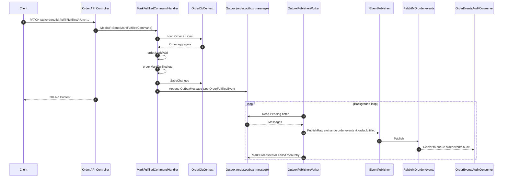

# 🧩 SmartShop Architecture

## 1) Component Overview

> Note: DB schemas — order, customer, product.

## 2) High‑Level Class Diagram

> Endpoints: GET /api/orders/fulfilled , PATCH /api/orders/{id}/fulfill

## 3) Sequence – Get Fulfilled Orders

## 4) Sequence – Fulfill Order -> Publish Event

